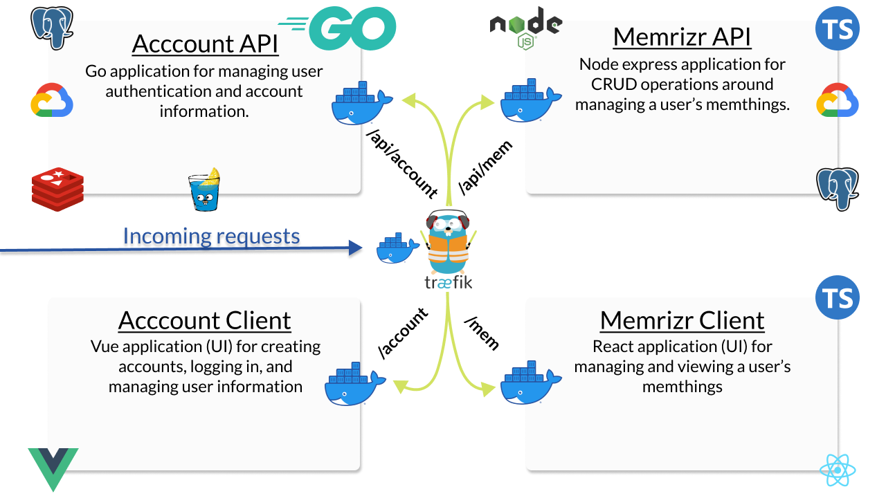

# Wordmem

This application is the initial prototype for the [Memrizr Tutorial](https://github.com/JacobSNGoodwin/memrizr) that is currently a work in progress.

### [YouTube Tutorial](https://www.youtube.com/playlist?list=PLnrGn4P6C4P6yasdEJnEUhueTjCGXGuFe)

### [DevTo Tutorial](https://dev.to/jacobsngoodwin/series/9052)

This application does no implement unit testing as you'll find in the tutorial, and some application features are behing improved in the tutorial. 

## Get Started

To run this code, you will need docker and docker-compose installed on your machine. In the project root, run `docker-compose up`.

Furthermore, Traefik will handle HTTP routes with HOST `wordmem.test`. So you will need to add the following to your hosts file.

`127.0.0.1       wordmem.test`

The hosts file can be found (to the best of my knowledge) at `~/etc/hosts` on Mac/Linux or `C:\Windows\System32\drivers\etc` on Windows. 

## Overview Of Application Services

An overview of the application can be viewed below. It is made up of 4 distinct services running inside of docker containers. These applications are routed behind a reverse proxy 

We create distinct services for the various features of the application. 

- Account Management is handled via a Go Application using the gin Framework. It uses Redis and Postgres for data persistence and Google Cloud Pubsub for Publishing events about users updates.
- A client for account management is built with Vue
- The API for adding items to memorize is built with a Node/Typescript application.
- The client for memorization is built with React/Typescript. 

I hope you find this app helpful!